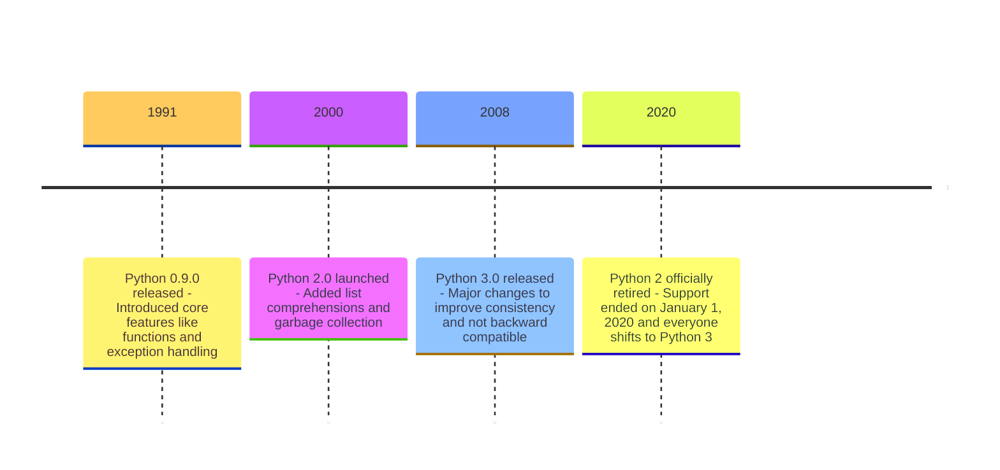
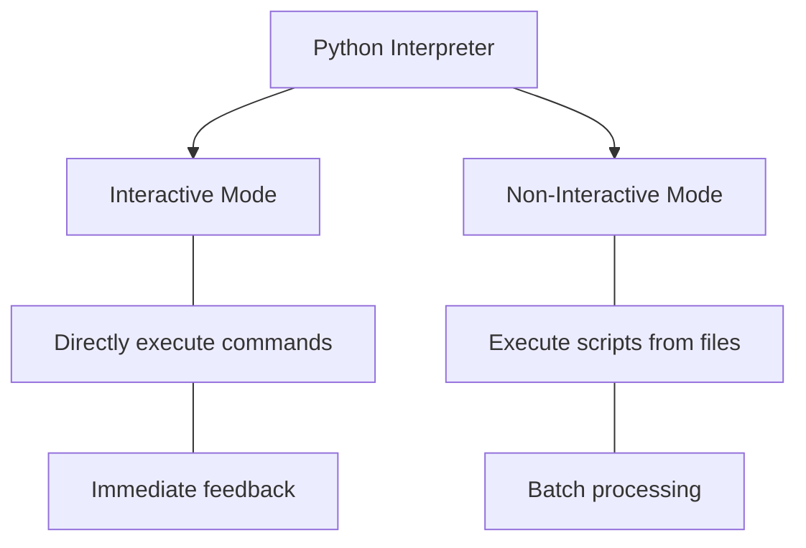

2024-10-20 21:01

Status: #ongoing

Tags: #python #programming-basics #interpreter

# Python Basics
Subject: [[Introduction to Python]]

[Python](https://en.wikipedia.org/wiki/Python_(programming_language)) was created by **[Guido van Rossum](https://en.wikipedia.org/wiki/Guido_van_Rossum)** and was first released in **1991**. Guido wanted to make a programming language that was easy to read and simple to use. He named it "Python" after the British comedy series *[Monty Python's Flying Circus](https://docs.python.org/3/faq/general.html#why-is-it-called-python)*, *not after the snake ;-;*



## Python Interpreter

Python provides two modes of operation:



### Interactive Mode

It is also know as **Python shell**, allows you to execute Python *commands line by line*.

To go into the interactive mode, open your *terminal* or *command prompt* and type `python` or `python3`:

```
$ python
Python 3.12.6 (tags/v3.12.6:a4a2d2b, Sep  6 2024, 20:11:23) [MSC v.1940 64 bit (AMD64)] on win32
Type "help", "copyright", "credits" or "license" for more information.
>>> 
```

Now you can start coding *hacker-man ;)*

```python
>>> print("Hello, World!")
Hello, World!
>>> 2 + 3
5
```

This mode is great for **testing small code snippets**.

### Non-Interactive Mode

In non-interactive mode, you write your Python code in a file (usually with a `.py` extension) and then run the entire file.

1. Create a file named `hello.py` with the following content:

   ```python
   print("Hello, World!")
   print("Welcome to Python!")
   ```

2. Run the file from the *terminal* or *command line*:

   ```
   $ python hello.py
   Hello, World!
   Welcome to Python!
   ```

This mode is used for running **larger programs** and **scripts**.

---
Next, we'll dive into [[Python Scripting]] to learn about data types, operators, and control structures.