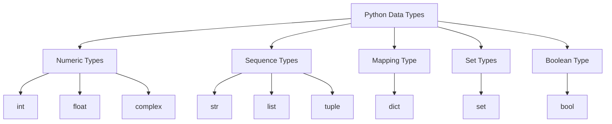

2024-10-20 21:20

Status: #ongoing

Tags: #python #data-types #operators #control-structures

# Python Scripting
Subject: [[Introduction to Python]]
## Data Types



### Numeric Types
1. **int**:
   - `int` is short for *Integer numbers*.
   - **Example**: 
```python
my_int = 42

print(my_float)
# Output: 42
```
   
2. **float**:
   - Represents *floating-point numbers* (numbers with a decimal point).
   - **Example**: 
```python
my_float = 3.14

print(my_float)
# Output: 3.14
```

3. **complex**:
   - Represents complex numbers, which have a real and an imaginary part.
   - **Example**: 
```python
my_complex = 3 + 4j

print(my_complex)
# Output: (3+4j)

print(my_complex.real)
# Output: 3.0

print(my_complex.imag)
# Output: 4.0
```

### Sequence Types
1. **str**:
   - `str` is short for **strings**, which are sequences of characters.
   - **Example**: 
```python
my_string = "Hello"

print(my_string)
# Output: Hello
```

2. **list**:
   - An ordered collection of items that can contain a mix of data types. Lists are mutable and written in square brackets.
   - **Example**: 
```python
my_list = [1, 2, 3, "Python"]

print(my_list)
# Output: [1, 2, 3, 'Python']
```

3. **tuple**:
   - An ordered collection of items similar to a list, but tuples are immutable and written in parentheses.
   - **Example**: 
```python
my_tuple = (1, 2, 3)

print(my_tuple)
# Output: (1, 2, 3)
```

### Mapping Type
1. **dict**:
   - A dictionary is an unordered collection of key-value pairs. Each key must be unique.
   - **Example**: 
```python
my_dict = {"name": "Alice", "age": 30}

print(my_dict)
# Output: {'name': 'Alice', 'age': 30}
```

### Set Types
1. **set**:
   - An unordered collection of unique elements.
   - **Example**: 
```python
my_set = {1, 2, 3}

print(my_set)
# Output: {1, 2, 3}
```

### Boolean Type
1. **bool**:
   - A boolean represents one of two values: `True` or `False`.
   - **Example**: 
```python
my_bool = True

print(my_bool)
# Output: True
```

## Operators

Python supports various types of operators:

1. **Arithmetic Operators**
   - `+` (addition), `-` (subtraction), `*` (multiplication), `/` (division)
   - `//` (floor division), `%` (modulus), `**` (exponentiation)

2. **Comparison Operators**
   - `==` (equal to), `!=` (not equal to)
   - `>` (greater than), `<` (less than), `>=` (greater than or equal to), `<=` (less than or equal to)

3. **Logical Operators**
   - `and`, `or`, `not`

4. **Assignment Operators**
   - `=`, `+=`, `-=`, `*=`, `/=`, `%=`, `**=`, `//=`

5. **Identity Operators**
   - `is`, `is not`

6. **Membership Operators**
   - `in`, `not in`

## Control Structures

Control structures direct the flow of your program:

1. **Conditional Statements**
   ```python
   if condition:
       # code block
   elif another_condition:
       # code block
   else:
       # code block
   ```

2. **For Loops**
   ```python
   for item in iterable:
       # code block
   ```

3. **While Loops**
   ```python
   while condition:
       # code block
   ```

4. **Break and Continue**
   - `break`: Exits the loop
   - `continue`: Skips the rest of the current iteration and moves to the next

Next, we'll explore [[Functions and Modules in Python]] to learn how to organize and reuse our code effectively.