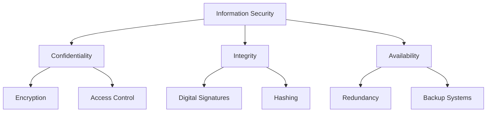
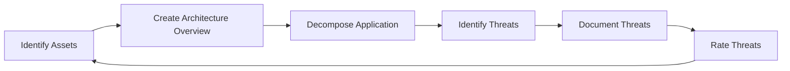
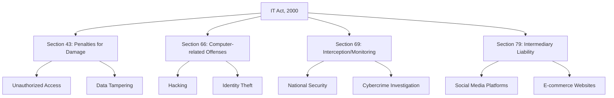
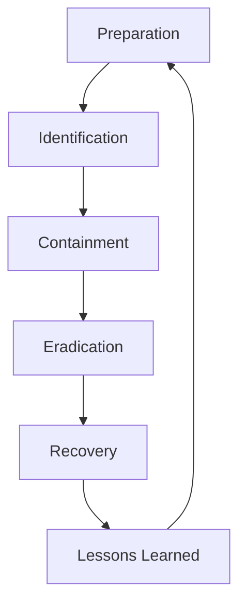
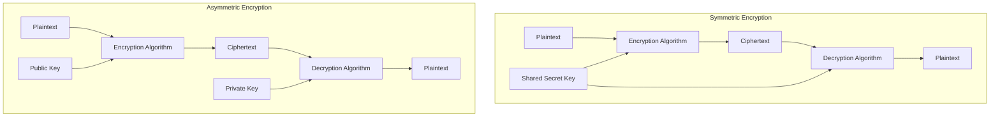

## 1. Introduction to Cybersecurity

### 1.1 Common Security Goals

The foundation of cybersecurity is built on three primary goals, known as the CIA triad:

- **Confidentiality**: Ensuring that information is kept secret from unauthorized parties.
    - Example: Using encryption for WhatsApp messages.
- **Integrity**: Guaranteeing that information remains unaltered during storage or transmission.
    - Example: Digital signatures on Aadhaar-based transactions.
- **Availability**: Making sure that information is accessible when needed.
    - Example: Redundant servers for critical government websites.

> 📝 **Exam Tip**: Be prepared to explain each component of the CIA triad with a real-world example, preferably in an Indian context.

### 1.2 Threat Modeling

Threat modeling is a proactive approach to identifying potential security risks:

> 💡 **Real-world Application**: Consider how CERT-In (Indian Computer Emergency Response Team) might use threat modeling to protect critical infrastructure.

### 1.3 Cyber Attack Trends

#### DDoS Attacks

- Definition: Overwhelming a system with traffic from multiple sources.
- Example: The 2022 DDoS attacks on Indian healthcare websites during the pandemic.

#### Cyber Espionage

- Definition: Unauthorized access to confidential information for economic or political gain.
- Case Study: The "Athens Affair" - wiretapping of Greek government officials' phones.

> 📝 **Exam Focus**: Be prepared to discuss recent cyber attacks in India and their impact on national security.

---

## 2. Cyber Laws

### 2.1 Information Technology Act, 2000

Key sections of the IT Act, 2000 and their implications:

> 💡 **Real-world Application**: Discuss how Section 79 affects social media companies operating in India.

### 2.2 E-commerce and Online Contracts

- Electronic contracts are legally binding under the IT Act.
- Digital signatures are equivalent to handwritten signatures.

> 📝 **Exam Tip**: Be ready to explain the legal validity of e-contracts in India with examples.

### 2.3 Intellectual Property Rights in Cyberspace

- Copyright protection for digital content
- Trademark issues in domain names
- Software patents and their controversies

> 💡 **Case Study**: Discuss the landmark case of Yahoo! Inc. vs Akash Arora regarding domain name disputes in India.

---

## 3. Management and Protection

### 3.1 Incident Response Cycle

> 📝 **Exam Focus**: Be prepared to explain each stage of the incident response cycle with examples relevant to Indian organizations.

### 3.2 Critical Infrastructure Protection

- Definition of critical infrastructure in the Indian context
- Sectors: Energy, Telecommunications, Banking, etc.
- National Critical Information Infrastructure Protection Centre (NCIIPC) role

> 💡 **Real-world Application**: Discuss how NCIIPC protects India's critical infrastructure from cyber threats.

### 3.3 Operating System and Network Security

- OS hardening techniques
- Network segmentation and firewalls
- Intrusion Detection and Prevention Systems (IDS/IPS)

> 📝 **Exam Tip**: Be ready to explain how these security measures work together to protect an organization's network.

---

## 4. Security Mechanisms and Algorithms

### 4.1 Encryption Types

> 💡 **Real-world Application**: Explain how WhatsApp uses end-to-end encryption for message security.

### 4.2 Classical Encryption Techniques

- Caesar Cipher
- Monoalphabetic Cipher
- Playfair Cipher

> 📝 **Exam Focus**: Be prepared to encrypt and decrypt simple messages using these classical techniques.

### 4.3 Modern Symmetric Ciphers

- Data Encryption Standard (DES)
- Advanced Encryption Standard (AES)

> 💡 **Case Study**: Discuss the transition from DES to AES in Indian banking systems.

### 4.4 Public Key Cryptography

- RSA Algorithm
- Digital Signatures
- Key Exchange protocols

> 📝 **Exam Tip**: Understand the mathematical principles behind RSA and be ready to solve simple encryption/decryption problems.